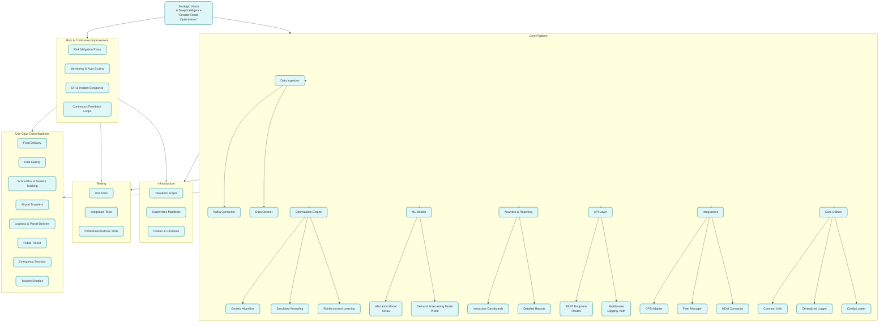

# RoutIQ
Smarter route optimization powered by deep intelligence

### Overview
This repository contains a comprehensive, enterprise‑grade route optimization platform that integrates real‑time data ingestion, advanced optimization algorithms, and robust analytics for operational efficiency. Designed with a microservices architecture and deployed using cloud‑native technologies, our solution transforms fleet management through innovative IoT and AI techniques.

### Key Features
- **Real-time Data Ingestion:** Leverages Kafka for streaming data from GPS, fleet management, and MDM systems.
- **Advanced Optimization Algorithms:** Utilizes Genetic Algorithms, Simulated Annealing, and Reinforcement Learning for dynamic route optimization.
- **Comprehensive Analytics:** Provides interactive BI dashboards and detailed reports for actionable insights.
- **Seamless Integrations:** Interfaces with external systems for GPS tracking, fleet management, and mobile device management.
- **Scalable & Resilient Architecture:** Built using Docker, Kubernetes, and Terraform for reliable and scalable deployment.

### Project Structure
```
route-optimization-platform/
├── docs/                   # Strategic and planning documents.
├── src/                    # Application source code.
│   ├── services/           # Microservices for optimization, analytics, ingestion, API, and integrations.
│   └── core/               # Common utilities and configuration loaders.
├── infra/                  # Infrastructure code (Terraform, Kubernetes, Docker).
├── ml/                     # Machine learning models and notebooks.
├── tests/                  # Unit, integration, and performance tests.
└── .github/                # CI/CD workflows and issue templates.
```
### Setup and Installation
1. **Clone the repository:**
    ```bash
    git clone https://github.com/your-org/fleet-optimization-platform.git
    cd fleet-optimization-platform
    ```
2. **Install dependencies:**
    ```bash
    pip install -r requirements.txt
    ```
3. **Run the application locally:**
    ```bash
    uvicorn src.services.api.routes:app --reload
    ```

### Deployment
- **Docker:** Use the provided Dockerfile and docker-compose for local development:
    ```bash
    docker-compose up --build
    ```
- **Kubernetes:** Deploy using manifests in `infra/kubernetes`.
- **Terraform:** Provision cloud resources using scripts in `infra/terraform`.

### Testing
- **Unit & Integration Tests:** Run tests using:
    ```bash
    pytest
    ```
- **Performance Testing:** Execute stress tests with:
    ```bash
    locust -f tests/performance/stress_test.py
    ```


