# Engineering and Architecture Overview

## High-Level Architecture
Our platform is designed as a cloud-native, microservices-based system that emphasizes scalability, resilience, and modularity.

### Core Components:
- **Data Ingestion Layer:**  
  - Utilizes API gateways and Kafka for real-time, high-volume data ingestion.
- **Processing Layer:**  
  - Implements data cleansing and validation using Apache Flink or Spark Streaming.
- **Core Engine:**  
  - Houses the hybrid optimization engine incorporating Genetic Algorithms, Simulated Annealing, and Reinforcement Learning.
- **Analytics & Reporting:**  
  - Aggregates data from multiple sources into SQL/NoSQL databases and a data warehouse, powering interactive BI dashboards.
- **Operations & Monitoring:**  
  - CI/CD pipelines, centralized logging (ELK), and distributed tracing (Jaeger) ensure robust operations and rapid fault detection.

## Microservices Design
- **Modularity:**  
  - Each service (data ingestion, optimization, analytics) is containerized using Docker.
  - Services communicate via REST APIs secured with OAuth2/JWT.
- **Scalability:**  
  - Services are deployed on Kubernetes, allowing horizontal scaling and rapid rollout of updates.
- **Resilience:**  
  - Built-in redundancy and automated failover mechanisms guarantee 99.99% uptime.
- **Security:**  
  - End-to-end encryption, regular vulnerability scanning, and adherence to OWASP best practices are integral.

## Key Artifacts
- **Architecture Diagrams:**  
  - Detailed visualizations of service interactions, data flows, and deployment topologies.
- **Infrastructure-as-Code:**  
  - Terraform and Kubernetes manifests that automate environment provisioning and deployment.
- **Performance Benchmarks:**  
  - Documented load tests and stress test results that validate system performance under peak conditions.

```mermaid
graph TD
    A[Cloud-Native, Microservices-Based System]
    A --> B[Data Ingestion Layer]
    A --> C[Processing Layer]
    A --> D[Core Engine]
    A --> E[Analytics & Reporting]
    A --> F[Operations & Monitoring]

    B --> B1[API Gateways]
    B --> B2[Kafka]
    
    C --> C1[Data Cleansing]
    C --> C2[Validation Flink/Spark Streaming]
    
    D --> D1[Genetic Algorithm]
    D --> D2[Simulated Annealing]
    D --> D3[Reinforcement Learning]
    
    E --> E1[SQL/NoSQL Databases]
    E --> E2[Data Warehouse]
    E --> E3[Interactive BI Dashboards]
    
    F --> F1[CI/CD Pipelines]
    F --> F2[Centralized Logging ELK]
    F --> F3[Distributed Tracing Jaeger]
    
    subgraph Microservices Design
      M1[Containerized with Docker]
      M2[REST APIs - OAuth2/JWT]
      M3[Deployed on Kubernetes]
      M4[Horizontal Scaling]
      M5[Redundancy & Automated Failover]
      M6[End-to-End Encryption & OWASP Compliance]
    end
    
    A --- M1
    A --- M2
    A --- M3
    A --- M4
    A --- M5
    A --- M6
    
    subgraph Key Artifacts
      K1[Architecture Diagrams]
      K2[Terraform & Kubernetes Manifests]
      K3[Performance Benchmarks]
    end
    
    A --- K1
    A --- K2
    A --- K3
```

